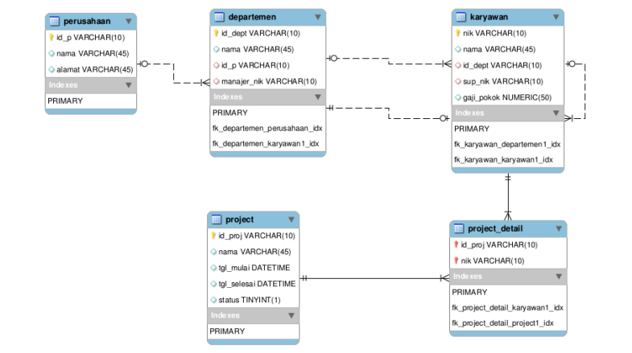
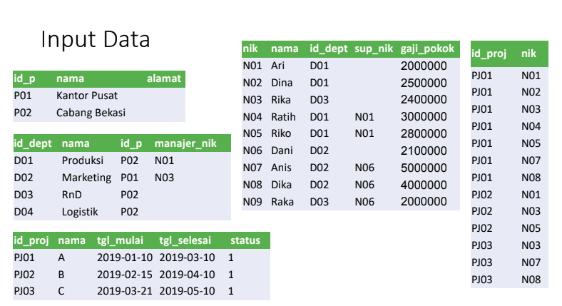

# Tugas Praktikum 5 (Pertemuan ke 15) 


|Nama|NIM|Kelas|Mata Kuliah|
|----|---|-----|------|
|**Radityatama Nugraha**|**312310644**|**TI.23.A6**|**Basis Data**|

# Sub Query
### Studi Kasus ERD Karyawan

# ER-Diagramnya :


# Input Data Studi Kasus Karyawan :


```
CREATE TABLE Perusahaan(
id_p VARCHAR(10) PRIMARY KEY,
nama VARCHAR(45) NOT NULL,
alamat VARCHAR(45) DEFAULT NULL
);

INSERT INTO Perusahaan (id_p, nama, alamat) VALUES
('P01', 'Kantor Pusat', NULL),
('P02', 'Cabang Bekasi', NULL);
SELECT * FROM Perusahaan;
```


