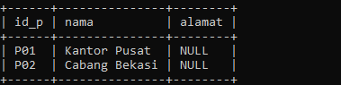
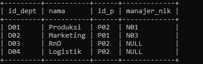
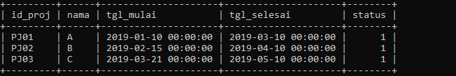
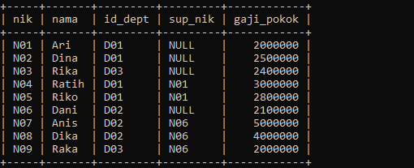
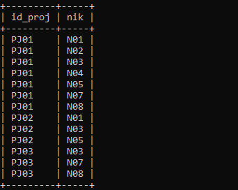
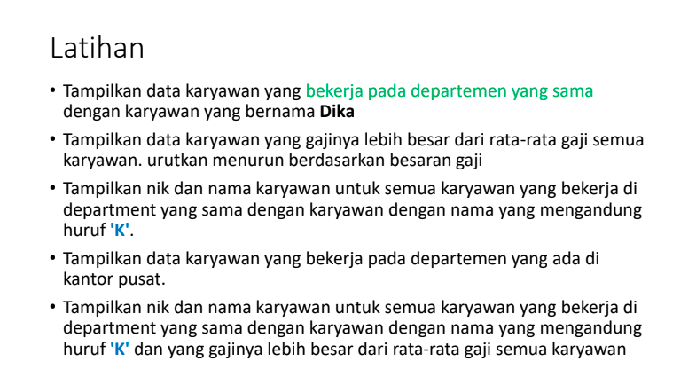
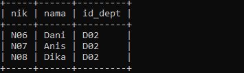
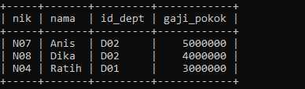
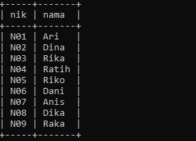
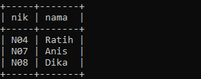

# Tugas Praktikum 7 (Pertemuan ke 15) 


|Nama|NIM|Kelas|Mata Kuliah|
|----|---|-----|------|
|**Radityatama Nugraha**|**312310644**|**TI.23.A6**|**Basis Data**|

# Sub Query
### Studi Kasus ERD Karyawan

# ER-Diagramnya :


# Data Studi Kasus Karyawan :


# Inputan Data nya :
```sql
CREATE TABLE Perusahaan(
id_p VARCHAR(10) PRIMARY KEY,
nama VARCHAR(45) NOT NULL,
alamat VARCHAR(45) DEFAULT NULL
);

INSERT INTO Perusahaan (id_p, nama, alamat) VALUES
('P01', 'Kantor Pusat', NULL),
('P02', 'Cabang Bekasi', NULL);
SELECT * FROM Perusahaan;
```
### Output nya :


```sql
CREATE TABLE Departemen(
id_dept VARCHAR(10) PRIMARY KEY,
nama VARCHAR(45) NOT NULL,
id_p VARCHAR(10) NOT NULL,
manajer_nik VARCHAR(10) DEFAULT NULL
);

INSERT INTO Departemen (id_dept, nama, id_p, manajer_nik) VALUES
('D01', 'Produksi', 'P02', 'N01'),
('D02', 'Marketing', 'P01', 'N03'),
('D03', 'RnD', 'P02', NULL),
('D04', 'Logistik', 'P02', NULL);
SELECT * FROM Departemen;
```
### Output nya :


```sql
CREATE TABLE Project(
id_proj VARCHAR(10) PRIMARY KEY,
nama VARCHAR(45) NOT NULL,
tgl_mulai DATETIME,
tgl_selesai DATETIME,
status TINYINT(1)
);

INSERT INTO Project (id_proj, nama, tgl_mulai, tgl_selesai, status) VALUES
('PJ01', 'A', '2019-01-10', '2019-03-10', '1'),
('PJ02', 'B', '2019-02-15', '2019-04-10', '1'),
('PJ03', 'C', '2019-03-21', '2019-05-10', '1');
SELECT * FROM Project;
```
### Output nya :


```sql
CREATE TABLE Karyawan(
nik VARCHAR(10) PRIMARY KEY,
nama VARCHAR(45) NOT NULL,
id_dept VARCHAR(10) NOT NULL,
sup_nik VARCHAR(10) DEFAULT NULL,
gaji_pokok INT
);

INSERT INTO Karyawan (nik, nama, id_dept, sup_nik, gaji_pokok) VALUES
('N01', 'Ari', 'D01', NULL, 2000000),
('N02', 'Dina', 'D01', NULL, 2500000),
('N03', 'Rika', 'D03', NULL, 2400000),
('N04', 'Ratih', 'D01', 'N01', 3000000),
('N05', 'Riko', 'D01', 'N01', 2800000),
('N06', 'Dani', 'D02', NULL, 2100000),
('N07', 'Anis', 'D02', 'N06', 5000000),
('N08', 'Dika', 'D02', 'N06', 4000000),
('N09', 'Raka', 'D03', 'N06', 2000000);
SELECT * FROM Karyawan;
```
### Output nya :


```sql
CREATE TABLE Project_detail(
id_proj VARCHAR(10) NOT NULL,
nik VARCHAR(10) NOT NULL
);

INSERT INTO Project_detail (id_proj, nik) VALUES
('PJ01', 'N01'),
('PJ01', 'N02'),
('PJ01', 'N03'),
('PJ01', 'N04'),
('PJ01', 'N05'),
('PJ01', 'N07'),
('PJ01', 'N08'),
('PJ02', 'N01'),
('PJ02', 'N03'),
('PJ02', 'N05'),
('PJ03', 'N03'),
('PJ03', 'N07'),
('PJ03', 'N08');
SELECT * FROM Project_detail;
```
### Output nya :




## • Tampilkan data karyawan yang bekerja pada departemen yang sama dengan karyawan yang bernama Dika
```sql
SELECT nik, nama, id_dept FROM Karyawan WHERE id_dept = (SELECT id_dept FROM Karyawan WHERE nama = 'Dika');
```
### Output nya :


## • Tampilkan data karyawan yang gajinya lebih besar dari rata-rata gaji semua karyawan. Urutkan menurun berdasarkan besaran gaji
```sql
SELECT nik, nama, id_dept, gaji_pokok FROM karyawan WHERE gaji_pokok > (SELECT AVG(gaji_pokok) FROM Karyawan) ORDER BY gaji_pokok DESC;
```
### Output nya :


## • Tampilkan nik dan nama karyawan untuk semua karyawan yang bekerja di departmen yang sama dengan karyawan dengan nama yang mengandung huruf 'K'.
```sql
SELECT nik, nama FROM Karyawan WHERE id_dept IN (SELECT id_dept FROM Karyawan WHERE nama LIKE '%K%');
```
### Output nya :


## • Tampilkan data karyawan yang bekerja pada departemen yang ada di Kantor pusat.
```sql
SELECT karyawan.nik, karyawan.nama, karyawan.id_dept FROM karyawan JOIN departemen ON karyawan.id_dept = departemen.id_dept WHERE departemen.id_p = 'P01';
```
### Output nya :

## • Tampilkan nik dan nama karyawan untuk semua karyawan yang bekerja di departmen yang sama dengan karyawan dengan nama yang mengandung huruf 'K' dan yang gajinya lebih besar dari rata-rata gaji semua karyawan
```sql
SELECT DISTINCT k1.nik, k1.nama FROM karyawan k1 JOIN karyawan k2 ON k1.id_dept = k2.id_dept WHERE k1.gaji_pokok > (SELECT AVG(gaji_pokok) FROM karyawan WHERE nama LIKE '%K%');
```
### Output nya :

